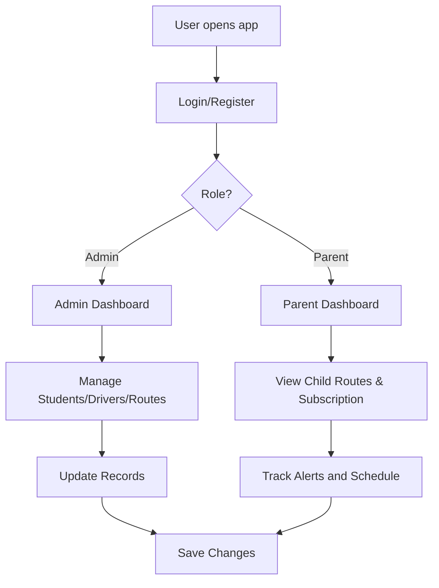

# VanGo Plus

## Project Documentation

## Abstract

In the modern era, school transportation and child safety have become critical concerns for parents, schools, and transport providers. Many institutions still depend on manual communication, fragmented route coordination, and inconsistent updates, which can create uncertainty during daily school commutes. VanGo Plus is a web-based school transport management platform designed to address these challenges by providing a centralized digital solution for route tracking, child monitoring, subscription management, and parent communication.

The primary goal of this system is to improve the safety, transparency, and convenience of school transportation services. VanGo Plus integrates several core modules, including Parent Dashboard, Admin Dashboard, Student Management, Driver Management, Route Management, Guardian Management, and Subscription Management. The platform allows parents to monitor pickup and drop-off activities, track route status, and manage subscription plans, while administrators can oversee student and driver records, route assignments, approvals, and daily transport operations.

The system is designed with a user-friendly interface and ensures accessibility for users with different levels of technical experience. It follows a modular architecture that supports future enhancements such as real-time GPS tracking, automatic notifications, payment gateway integration, and advanced analytics. By combining transport operations, parent visibility, and digital account management into a single platform, VanGo Plus aims to build a safer and more efficient school transportation ecosystem.

---

## Acknowledgement

We would like to express our sincere gratitude to our respected supervisor, Ma'am Zaima Illyas, for her valuable guidance, encouragement, and constructive feedback throughout the development of this project. Her expertise and practical suggestions helped us transform the initial idea into a functional and meaningful platform.

We would also like to thank the faculty members of the Computer Science Department, University of Science and Technology, for providing us with the knowledge, resources, and support needed to complete this project successfully. Our appreciation also goes to our families, friends, and team members for their continuous support and cooperation.

---

## Dedication

This project is dedicated to Allah Almighty, the source of wisdom, strength, and guidance, for granting us the courage and knowledge to complete this work. We also dedicate this report to our parents, family, and friends for their unwavering support and motivation.

---

## Contents

1. Chapter 1: Introduction
   1.1 Objectives
   1.2 Problem Statement
   1.3 Assumptions and Constraints
   1.4 Project Scope

2. Chapter 2: Requirement Analysis
   2.1 Literature Review
   2.2 List of Stakeholders
   2.3 Functional Requirements
   2.4 Non-Functional Requirements
   2.5 Requirements Traceability Matrix (RTM)
   2.6 Use Case Description
   2.7 Software Development Life Cycle Model

3. Chapter 3: System Design
   3.1 Work Breakdown Structure (WBS)
   3.2 Activity Diagram
   3.3 Sequence Diagram
   3.4 Class Diagram
   3.5 Object Diagram
   3.6 Use Case Diagrams
   3.7 ERD (Entity Relationship Diagram)
   3.8 Collaboration Diagram
   3.9 State Transition Diagram

4. Chapter 4: System Testing
   4.1 Test Cases
   4.2 Unit Testing
   4.3 Integration Testing
   4.4 Acceptance Testing

5. Chapter 5: Screenshots and User Interface

6. Chapter 6: Conclusion
   6.1 Problems Faced
   6.2 Lessons Learned
   6.3 Project Summary
   6.4 Future Work

7. Chapter 7: References

Appendices

---

# Chapter 1: Introduction

## 1.1 Objectives

The main objectives of VanGo Plus are as follows:

- To create a centralized school transport management platform for parents and administrators.
- To provide an easy way to manage student records, drivers, routes, and subscriptions.
- To improve daily school commute transparency by showing route status and trip updates.
- To support parent access to account management, route details, and subscription plans.
- To design a responsive, scalable, and user-friendly web application.
- To provide role-based access for admin and parent users.

## 1.2 Problem Statement

School transportation is an essential service, but many parents and schools still experience difficulties with communication, tracking, and scheduling. Traditional systems often rely on manual updates, phone calls, and unstructured record keeping. This can lead to confusion, delayed updates, poor route management, and reduced safety.

VanGo Plus solves this problem by providing a single web platform where parents can monitor their children’s travel status, schools and administrators can manage transport operations, and subscription plans can be handled digitally. The result is improved trust, reduced uncertainty, and more efficient transport management.

## 1.3 Assumptions and Constraints

### Assumptions

- Users have an internet connection and can access the web application.
- Users have basic knowledge of web browsing and online account management.
- Parent and administrator data will be entered correctly and maintained regularly.
- The application will be used in a school or transport service environment with stable internal operations.

### Constraints

- The project is developed within the academic timeframe of a final-year project.
- The initial version focuses on a functional prototype rather than a full enterprise-grade system.
- Security features are designed to meet standard web application expectations, not full industrial compliance requirements.
- The current system uses simulated authentication and local storage-based data handling for demonstration purposes.

## 1.4 Project Scope

### In Scope

- User login and registration
- Parent dashboard
- Admin dashboard
- Student management
- Driver management
- Route management
- Guardian management
- Subscription and payment flow
- Route and trip status monitoring
- Responsive user interface
- Role-based navigation and access

### Out of Scope

- Real-time GPS live tracking from physical devices
- Real vehicle telematics integration
- Advanced AI-based route optimization
- Full backend database integration with a production-grade server
- Integration with payment gateways in a live commercial environment

---

# Chapter 2: Requirement Analysis

## 2.1 Literature Review

Many educational institutions and transport providers are moving toward digital systems to manage school rides more effectively. Existing studies in transport management systems show that digital dashboards reduce manual work, improve communication, and streamline scheduling. Similar systems emphasize the importance of route monitoring, attendance tracking, payment management, and parent notifications.

This project makes use of the same principles, adapting them to a modern school transportation scenario. The platform focuses on transparency, usability, and accessibility so that both parents and administrators can use it effectively without requiring advanced technical knowledge.

## 2.2 List of Stakeholders

### Primary Stakeholders

- Parents
- Students
- Drivers
- Administrators
- School transport coordinators

### Secondary Stakeholders

- School management
- Front desk staff
- Support team
- System developer

## 2.3 Functional Requirements

The system must provide the following functionalities:

1. User registration and login
2. Role-based access for admin and parent accounts
3. Admin dashboard for overview statistics
4. Parent dashboard for trip status and child monitoring
5. Student record management
6. Driver record management
7. Route assignment and route management
8. Guardian approval and management
9. Subscription plan management
10. Notifications and alerts for schedule or route updates
11. Settings and account management

## 2.4 Non-Functional Requirements

- Usability: Intuitive and simple interface for all users
- Performance: Fast loading and smooth navigation
- Security: Secure session handling and protected user data
- Reliability: Consistent work flow for key operations
- Scalability: Ability to support more students, drivers, and routes in future versions
- Responsiveness: Works across desktop, tablet, and mobile devices

## 2.5 Requirements Traceability Matrix (RTM)

| Requirement ID | Requirement Description | Priority | Module | Status |
|---|---|---:|---|---|
| RQ-01 | User registration | High | Authentication | Implemented |
| RQ-02 | User login | High | Authentication | Implemented |
| RQ-03 | Parent dashboard | High | Parent Portal | Implemented |
| RQ-04 | Admin dashboard | High | Admin Portal | Implemented |
| RQ-05 | Student management | High | Admin Module | Implemented |
| RQ-06 | Driver management | High | Admin Module | Implemented |
| RQ-07 | Route management | High | Admin Module | Implemented |
| RQ-08 | Guardian management | Medium | Parent/Admin Module | Implemented |
| RQ-09 | Subscription management | High | Parent Module | Implemented |
| RQ-10 | Route status updates | High | Parent/Admin Module | Implemented |
| RQ-11 | Settings management | Medium | Parent/Admin Module | Implemented |
| RQ-12 | Responsive UI | High | Frontend | Implemented |

## 2.6 Use Case Description

### Admin Use Cases

- Login to the admin portal
- View dashboard statistics
- Add and update student records
- Manage driver details
- Create and monitor routes
- Approve or review guardian requests
- Manage subscriptions and service plans
- Adjust settings and administrative preferences

### Parent Use Cases

- Register and create a parent account
- Login to the parent portal
- View child trip statuses
- Add guardian contacts
- Manage subscription plans
- Review schedule information
- Access account settings

## 2.7 Software Development Life Cycle Model

The project follows the Agile Development Model. This approach enables iterative development, quick feedback cycles, and flexible updates as new requirements emerge. The development was organized into small features and modules, each reviewed and refined during successive iterations. This method is suitable for student projects because it supports continuous improvement and easy adaptation to changing requirements.

---

# Chapter 3: System Design

## 3.1 Work Breakdown Structure (WBS)

The development of VanGo Plus can be broken into the following work packages:

1. Requirement gathering and analysis
2. Project planning and scope definition
3. UI/UX design and wireframing
4. Frontend development
5. Authentication and role management
6. Student, driver, and route modules
7. Parent portal and dashboard development
8. Subscription and plan management
9. Testing and bug fixing
10. Documentation and final review

## 3.2 Activity Diagram

The primary activities of the system include:

- User logs in
- Role is verified
- User is redirected to appropriate dashboard
- Admin manages operations
- Parent views child trips and subscription status
- Data is updated and saved in the system
- Alerts and notifications are displayed

A simplified flow is:

## 3.3 Sequence Diagram

A typical action flow for a parent is as follows:

1. Parent logs in
2. System verifies credentials
3. Dashboard loads route and child data
4. Parent views trip updates
5. Parent manages subscription or guardian information
6. System updates the local record and refreshes the dashboard

This can be represented as an interaction between User, System, and Data Store.

## 3.4 Class Diagram

The system includes core classes such as:

- User
- Admin
- Parent
- Student
- Driver
- Route
- Guardian
- Subscription
- Dashboard

These entities are connected through role-based access and operational records. For example:

- One parent can manage multiple children
- One student can be assigned to one route
- One driver can be assigned to one or more routes
- One subscription is linked to a parent account

## 3.5 Object Diagram

Examples of runtime objects may include:

- Parent: Sarah Mitchell
- Student: Leo Mitchell
- Driver: Ahmed Ali
- Route: Route #42B
- Subscription: Standard Plan

These objects represent real instances used in the demo environment.

## 3.6 Use Case Diagrams

Use cases cover the following scenarios:

- Admin logs in and reviews transport dashboard
- Parent logs in and checks child trip status
- Parent adds guardian information
- Admin updates route assignments
- Parent chooses or updates subscription plan

## 3.7 ERD (Entity Relationship Diagram)

The system database is designed around the following entities:

- User
- Parent
- Student
- Driver
- Route
- Guardian
- Subscription
- Setting
- Alert

Relationships include:

- Parent to Student (one-to-many)
- Student to Route (many-to-one)
- Driver to Route (one-to-many)
- Parent to Subscription (one-to-one or one-to-many)
- Route to Alert (one-to-many)

## 3.8 Collaboration Diagram

The collaboration diagram illustrates communication among:

- Parent
- Admin
- System
- Database/Storage

This shows the sequence of actions for registration, login, route review, and payment management.

## 3.9 State Transition Diagram

The major states of the system include:

- Logged Out
- Login
- Dashboard
- View Child/Route Details
- Manage Subscription
- Logout

For route status, possible states include:

- Waiting
- Picked Up
- Dropped Safely

---

# Chapter 4: System Testing

## 4.1 Test Cases

The application was evaluated using test scenarios such as:

- User registration
- Login validation
- Password errors
- Parent dashboard display
- Admin dashboard summary
- Subscription selection and management
- Add guardian flow
- Route and trip status handling
- Settings navigation

## 4.2 Unit Testing

Unit testing focuses on isolated functions and UI behavior such as:

- Email validation
- Password validation
- User authentication logic
- Role-based rendering
- Form submission handling
- Subscription price/display logic

## 4.3 Integration Testing

Integration testing ensures that modules work together correctly, including:

- Login redirect to correct dashboard
- Parent data and child data display
- Route and schedule updates in dashboard
- Subscription management updates visible in parent account
- Admin record management interactions

## 4.4 Acceptance Testing

User acceptance testing verifies that the application meets user requirements. The interface is checked for ease of use, clarity, and navigation. The project is considered acceptable when the main workflows are understandable, role-based dashboards work correctly, and essential transport management functions can be completed successfully.

---

# Chapter 5: Screenshots & User Interface Summary

## Landing Page

The landing page includes branding, feature highlights, pricing plans, and call-to-action buttons such as Sign In and Get Started. It presents the core value proposition of VanGo Plus in a user-friendly layout.

## Login and Registration

A clean login form is provided for users to access the system. The registration flow supports account creation for parents and demo credentials for testing.

## Admin Dashboard

The admin dashboard displays:

- Total students
- Drivers
- Routes
- Subscription due indicators
- Guardian approvals
- Student and route overview tables

## Parent Dashboard

The parent dashboard shows:

- Children trip cards
- Route and pickup times
- Status indicators such as Waiting, Picked Up, and Dropped Safely
- Quick actions including Add Guardian and Pay Fee
- Subscription status card

## Subscription and Settings

The subscription section shows multiple pricing levels and account management features, while settings allow the user to update profile and account preferences.

---

# Chapter 6: Conclusion

## 6.1 Problems Faced

During the project development, some challenges were encountered, including:

- Requirement clarification between different user roles
- Designing a responsive UI for multiple role portals
- Managing navigation and state consistency
- Simulating real business workflows in a prototype environment
- Limited scope for backend integration and real payment processing

## 6.2 Lessons Learned

The project provided valuable lessons in:

- Requirement analysis and scope management
- UI/UX design for real-world systems
- Role-based access implementation
- Frontend development with modern frameworks
- Documentation and structured project planning

## 6.3 Project Summary

VanGo Plus is a web-based school transport management system designed to improve the daily commute experience for parents, students, and administrators. The application provides secure role-based access, trip visibility, route management, student driver tracking, guardian communication, and subscription management in a single digital platform.

## 6.4 Future Work

The proposed future improvements for the system include:

- Real-time GPS tracking integration
- Mobile application support
- AI-based route optimization
- Automated notifications via SMS and email
- Full backend database and API integration
- Real payment gateway support
- Advanced analytics and reporting

---

# Chapter 7: References

1. Booking Ninjas, Gym and Transport Management Software Benefits and Best Practices.
2. World Health Organization (WHO), Global Action Plan on Physical Activity and Healthy Lifestyle Awareness.
3. A. Ariesta et al., Agile Method in Software Development.
4. Responsive Web Design, Wikipedia guidelines on fluid grids and media queries.
5. P. C. Chikere & E. L. Poi, Customer Service and Organizational Management.
6. H. Handayani et al., Web-based Information System Development Using Agile Method.
7. N. T. Nguyen & M. G. Simkin, Digital Subscription Models in Service Platforms.
8. Fitness and healthy lifestyle research references relevant to online service platforms.
9. Official Next.js and React documentation.
10. Tailwind CSS documentation.

---

## Appendix A: Project Technologies

The current implementation of VanGo Plus is built using:

- Next.js
- React
- TypeScript
- Tailwind CSS
- Lucide React icons
- Local storage-based mock authentication for prototype usage

## Appendix B: Project Modules

- Authentication
- Admin Dashboard
- Parent Dashboard
- Student Management
- Driver Management
- Route Management
- Guardian Management
- Subscription Management
- Settings

## Appendix C: Summary

VanGo Plus is a practical and modern transport management solution focused on safety, communication, and operational clarity. It demonstrates the use of web-based system design, role-based interfaces, and digital service management in a real-world educational transport environment.
